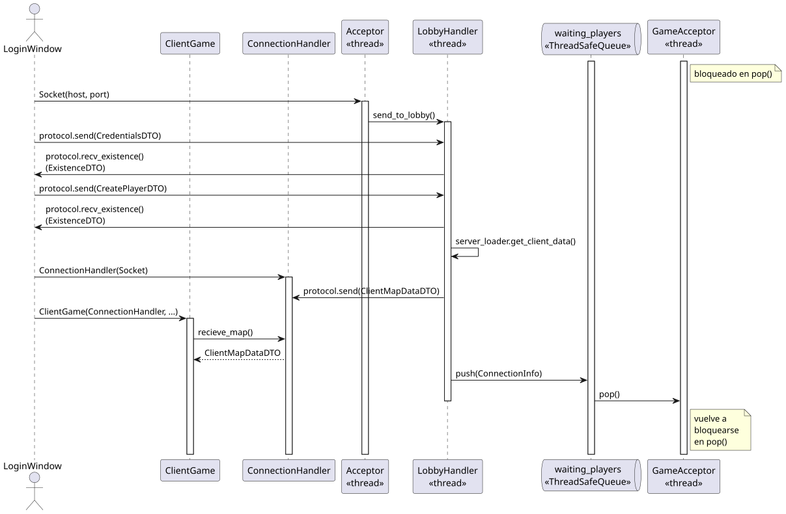
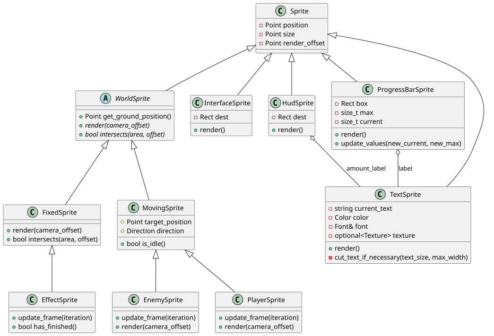
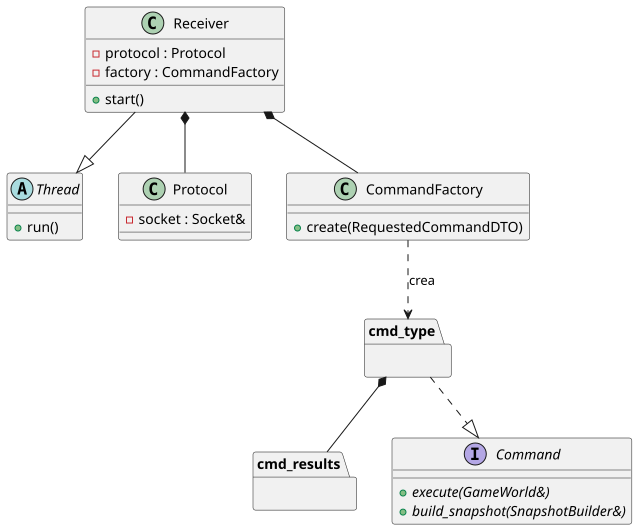
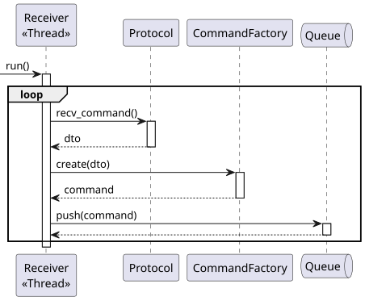
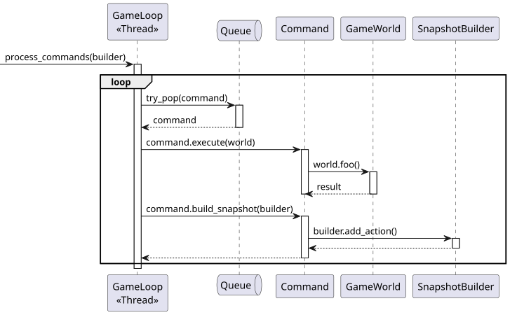
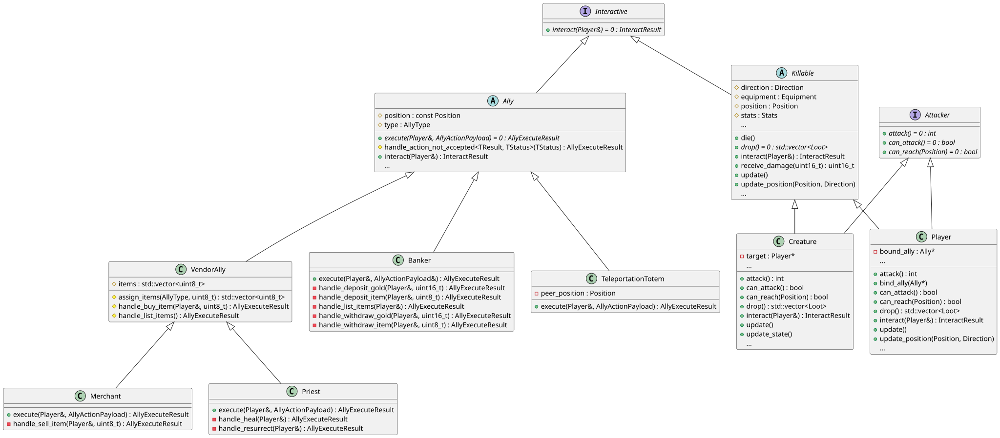
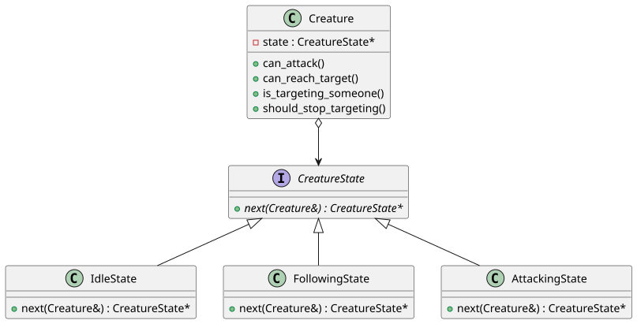
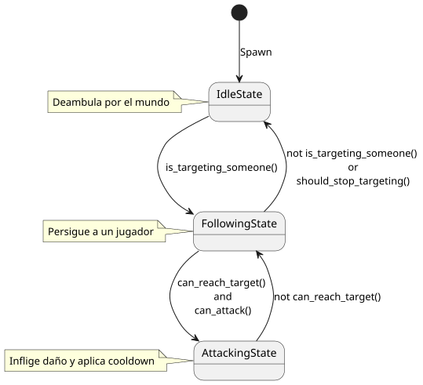

# Documentación técnica

## Arquitectura general

El juego cuenta con una arquitectura Cliente — Servidor. Tanto cliente como servidor tienen hilos `Sender` y `Receiver`. El servidor cuenta con varios hilos además de estos, en los cuales se delegan distintas responsabilidades del mismo.

### Hilos del Servidor

El Servidor tiene múltiples hilos de ejecución.

- El hilo `main` se queda esperando a que se ingrese ‘q’ por entrada estandar para finalizar la ejecución de todo el servidor. Es el hilo encargado de reservar los recursos, lanzar todos los hilos y luego liberar estos recursos.
- El hilo `Acceptor` tiene como objetivo aceptar nuevas conexiones. Se bloquea esperando a que se conecte un nuevo cliente al servidor, y al recibir la conexión, lanza un hilo `LobbyHandler` para que maneje la comunicación con el mismo hasta que entre al juego o cierre el lobby.
- Los hilos `LobbyHandler`, como ya mencionamos se encargan de manejar la comunicación con el cliente hasta que se ingrese al juego o este cierre el programa. Existirá uno por cada cliente que simultáneamente esté en el lobby. En el caso feliz, tras validar el personaje del cliente y pedirle la información para crearlo si es necesario, se pasa el jugador a la `waiting_players_queue`.
- El hilo `GameAcceptor` se bloquea tratando de obtener el próximo jugador de `waiting_players_queue`. Al obtenerlo, crea un `ClientHandler` y envía un comando de spawn por la `command_queue`.
- `ClientHandler` no es un hilo, sino una clase que maneja 2 hilos, que existen por cada cliente conectado al servidor: `Sender` y `Receiver`. `Sender` envía constantemente las nuevas `SnapshotsDTO` que le envíe el `GameLoop`, mientras que `Receiver` recibe todos los `EventsDTO` enviados por el cliente, convirtiéndolos en comandos consumibles por el `GameLoop`.
- El hilo `GameLoop` se encarga de procesar todos los comandos que reciba de todos los clientes (iterando su `command_queue`), actualiza el estado del mundo y realiza broadcast de la `SnapshotDTO`  (enviándosela a todos los hilos `Sender`)  que contiene el estado actual del mundo y todas las `ActionDTO` realizadas en esa iteración.

### Hilos del Cliente

El cliente, por otro lado, cuenta solamente con 3 hilos.

- El hilo `main` ejecuta toda la lógica del `LoginWindow`, y luego ejecuta su lógica principal de `ClientGame`.
- El hilo `ClientReceiver` busca constantemente obtener las nuevas `SnapshotDTO` que le llegan por protocolo y enviárselas al `ClientGame`.
- El hilo `ClientSender` busca constantemente enviar los nuevos `EventDTO` que se detecten.

## Protocolo de Comunicación

### Bases de la comunicación

El protocolo de comunicación propone una interfaz común para todo DTO que vaya a viajar por la red, `ProtocolMessageDTO`. Además, todos los DTO fueron modelados como `struct`, para fácil acceso a sus miembros. Los métodos que deben implementar los mensajes son: 

- `size_t message_size() const`: devuelve el tamaño de la estructura, sumando los bytes que ocupan cada uno de sus miembros.
- `void accept(Serializer& serializer) const`: Este método debe implementarse para que `serializer` únicamente haga `serializer.serialize(*this)`. La idea es implementar el patrón *double dispatch*.

El protocolo tiene dos clases auxiliares que ayudan a la hora de la transmición y recepcioń de mensajes a través de los sockets. `Serializer` implementa sobrecargas sobre su método `serialize` para cada nuevo DTO. El objetivo es que use sus métodos auxiliares para serializar en bytes los miembros de la estructura, escribiendolos sobre un buffer que se envia por red. `Deserializer` lee del socket según la estructura esperada. 

Cuando se manda un mensaje por red, para que el `Deserializer` sepa qué hacer, debe escribirse como primer byte un código de mensaje, que lo identifica del resto. Esto se suele hacer normalmente sobre la sobrecarga correspondiente al DTO.

> Algunos DTOs contienen otros DTOs, pero el único que requiere ese byte identificador es el DTO padre que los contiene a todos.
> 

### Handshake

El *handshake* es el proceso que ocurre desde que un jugador abre el cliente hasta que es aceptado por el servidor para entrar al mundo.

Cuando el usuario ingresa su nombre, dirección de host y puerto del servidor, se realiza la conexión, la cual es aceptada por el `Acceptor`. Este último crea un `LobbyHandler` que esperará las `CredentialsDTO` del usuario para corroborar si debe crear su personaje. Si es la primer conexión del usuario, se le envía un `ExistanceDTO` que le pide los datos de personalización al cliente. En tal caso, se queda esperando un `CreatePlayerDTO`. Si el nombre de usuario ya estaba registrado, se envía un `ExistanceDTO` para indicar si ya está conectado o no.

Si la conexión con ese nombre de usuario es posible, el servidor manda un `ClientMapDataDTO` con toda la información visual del mundo. Acto seguido, se encola al jugador a una cola que el `GameAcceptor` procesa para meter a los jugadores al mundo.

Desde el lado del cliente, se crea un `ConnectionHandler`, que crea el  `ClientSender` para comunicar los eventos que crea, y el `ClientReceiver` para saber las acciones que tiene que procesar. El `ClientGame` lo usa para recibir la información del `ClientMapDataDTO`.

### Tipos de mensaje dentro del juego

#### EventDTO

Son los DTOs que se envían desde el cliente al servidor. Únicamente cuenta con un `CommandType command` como campo, que indicará cómo el servidor interpreta el evento. Como algunos eventos necesitan más información que ese único byte, se crean estructuras que heredan de `EventDTO`, agregando los campos necesarios y pisando las implementaciones de los métodos indicados arriba.

#### SnaspshotDTO

Es el DTO que se envía del Servidor al Cliente. Se envía al finalizar cada uno de los ciclos que procesa `GameLoop`. Se encarga de sumar toda la información que ocurrió durante un ciclo. Las estructuras que componen a esta “imagen” son:

- `PlayerInfoDTO`: Incluye la información que el cliente debe interpretar para renderizar a un jugador y los datos del mismo sobre su interfaz.
- `CreatureInfoDTO`: Incluye la información que el cliente debe interpretar para renderizar a una *Creature* sobre el mundo.
- `LootInfoDTO`: Incluye la información que el cliente debe interpretar para renderizar el *Loot* sobre el suelo del mundo.
- `ActionDTO`: Representan el resultado de los eventos mandados por el usuario al servidor. La estructura se compone de muchos otros DTOs, pero solo se inicializa el del tipo que se va a mandar en esta acción.

## Cliente

La ejecución y estructura del cliente puede separarse en dos fases o secciones bien definidas. Una primera etapa lanzará en el hilo principal una aplicación de QT, y una vez finalizada se dará paso a la aplicación de SDL que se encarga propiamente del juego. 

### SDL2pp

Para el renderizado del juego, se utilizó `SDL2pp`. Y dentro de lo posible, se aplicó el patrón Facade. Haciendo que estructuras de más bajo nivel como `SDL2pp::Texture` sean manejadas por clases de bajo nivel como `SpriteLayer`. Y que las clases de más alto nivel como son los`Sprites` solo tengan que llamar a los métodos de renderizado de los mismos.

### Sprites

Dependiendo de qué elemento del juego se trate, hay distintos comportamientos. El suelo del juego o los elementos de la interfaz permanecen inmóviles, mientras que un jugador debe actualizar su dirección y mostrar las animaciones de movimiento cuando cambie su posición de manera dinámica. Por esto se aplicó una jerarquía de herencia de clases para evitar código repetido y seguir SRP (Single Responsibility Principle). 

### Texturas, animaciones y sonidos

Para ahorrar memoria, se utilizaron las clases `TexturePool`, `AnimationPool` y `SoundPool`.  Estas implementan el patrón Flyweight, cargando los archivos a memoria sola 1 vez evitando, por ejemplo, que los sonidos tengan que cargarse desde disco a RAM cada vez que se utilizan, y permitiendo que no haya varias instancias de la misma textura (`SDL2pp::Texture`), sino que varios `SpriteLayer` utilicen la misma textura que está cargada solo 1 vez en memoria.

## Servidor

En cuanto al servidor, se destacan las siguientes decisiones de diseño:

- La implementación del patrón Command para permitir la interacción de un jugador con el mundo del juego.
- La definición de la interfaz `Interactive`, que es implementada por clases abstractas que a su vez son extendidas mediante herencia a clases concretas como la representación lógica de los jugadores y los NPC tanto aliados como hostiles (también conocidas como criaturas).
- La utilización del patrón State para controlar el comportamiento de las criaturas frente a la presencia o no de un jugador en sus cercanías.

### Comandos

Una vez iniciado el juego, la comunicación Cliente → Servidor se realiza mediante `EventDTO`, que se reciben en forma de `RequestedCommandDTO` través del protocolo en el hilo `Receiver`.

Cada `RequestedCommandDTO`  construido en base al `EventDTO` pasa como input de `CommandFactory::create()` para convertirse en un comando consumible por `GameLoop`; que en `process_commands()` vacía la `command_queue` sacando de esta punteros a estructuras que cumplen con la interfaz `Command`.

Cada `Command` implementa sus métodos `execute(GameWorld&)` y `build_snapshot(SnapshotBuilder&)` para cumplir su objetivo específico. Es por esto que cada uno ejecuta distintos métodos de `GameWorld` para cambiar su estado interno en caso de ser necesario, o simplemente obtener un `result` para poder informar en la próxima `SnapshotDTO` la acción realizada, utilizando el método `SnapshotBuilder::add_action(const ActionDTO&)`.

### Interactuables

La interacción con las entidades del mundo se logra mediante la abstracción del método `interact(Player&)` dado por la interfaz `Interactive`, la cual es implementada por dos clases abstractas:

- `Ally`: Para manejar la lógica al interactuar con un NPC aliado (como un sacerdote, comerciante, banquero o tótem de teletransportación). Se destaca también la clase intermedia `VendorAlly` que alberga la lógica relacionada a la consulta de objetos a la venta y a la compra de los mismos (en el sentido de que un jugador le compre a un NPC). Un detalle a destacar es que interactuar con un aliado (hacerle clic) implica **vincularse** (*bind*) al mismo.
- `Killable`: Con la finalidad de controlar la interacción con las entidades hostiles, aquellas que son capaces de recibir daño y morir. De esta clase se desprenden las clases de `Creature` y `Player` (que a su vez implementan la interfaz `Attacker`). En este sentido, cuando un *killable* recibe un ataque, lo hace mediante un *attacker*, o a la inversa, cuando un *attacker* realiza un ataque, se lo hace a un *killable*. Bajo este esquema, interactuar con un *killable* implica atacarlo.

### Criaturas

Como se logra apreciar, toda criatura del juego presenta en todo momento uno de los siguientes tres estados: inactiva (*idle*), siguiendo (*following*), o atacando (*attacking*).

Esto se logra mediante la interfaz `CreatureState` que es implementada por los tres estados concretos, que siempre conocen cómo transicionar al siguiente estado gracias al método `CreatureState::next(Creature&)`, que según la evaluación de determinadas condiciones permite pasar de un estado a otro.

Cabe aclarar que algunas de las condiciones están dadas por la distancia entre la criatura y el jugador o el cooldown de ataque de la misma.